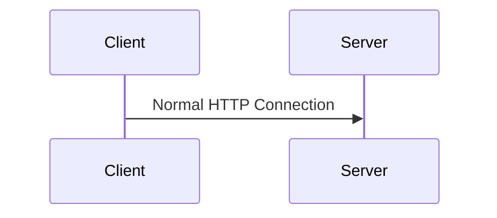
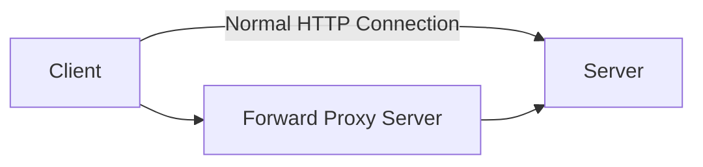
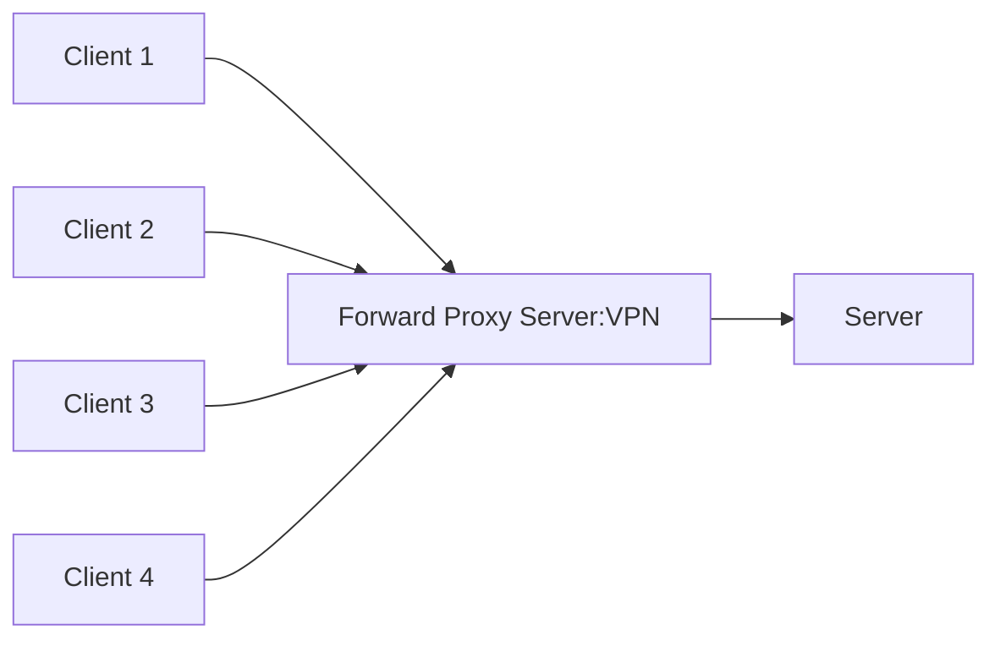

## NGINX 

- Pronounciation :Engine X
- PowerFul Web Server
- Uses non-threaded and event driven structure
- Used as

**Installation using Docker**

```
docker pull nginx
```

**Run Command Using Dcoker**

```
docker run -p 8000:80 nginx
```
**Diagram of Normal HTTP Connection**

**Diagram of HTTP Connection with VPN**
 - Forward Proxy Sever is used to connect to the VPN


