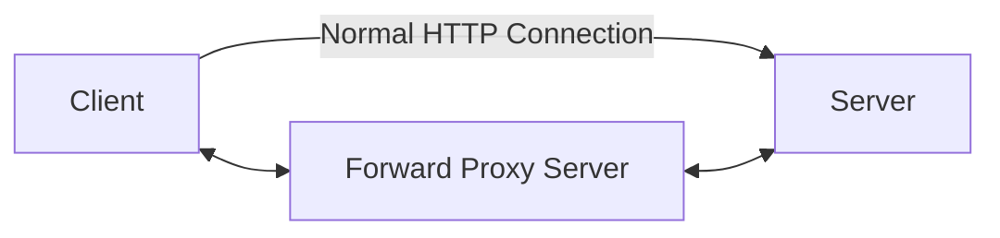
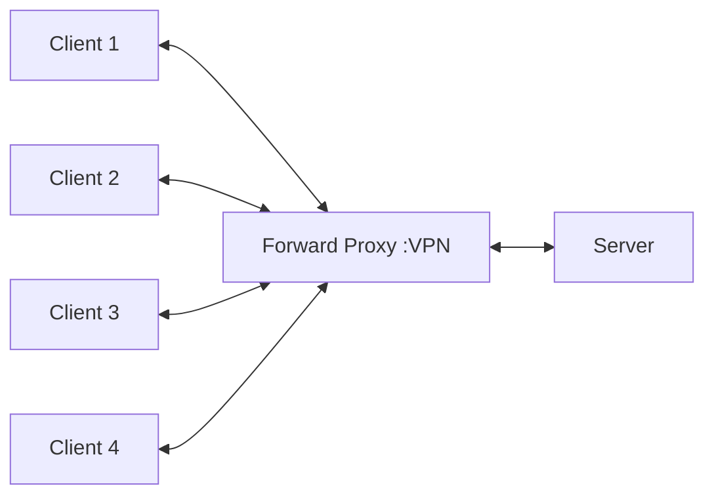
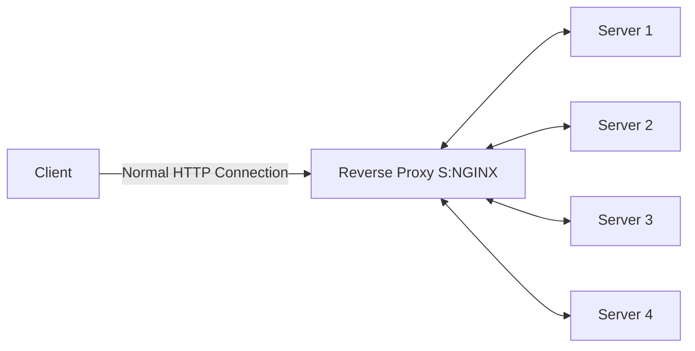

## NGINX 

- Pronounciation :Engine X
- PowerFul Web Server
- Uses non-threaded and event driven structure
- Used as a reverse proxy server, load balancer, mail proxy server, and HTTP cache

**Installation using Docker**

```
docker pull nginx
```

**Run Command Using Dcoker**

```
docker run -p 8000:80 nginx
```
**Diagram of Normal HTTP Connection**

**Diagram of HTTP Connection with VPN**
 - Forward Proxy Sever is used to connect to the VPN


- Server is not able to identify the client in forward proxy server
   - Forward Proxy Server is used to connect to the VPN

**Connection of NGINX**

- NGINX is used to connect to the VPN
  - Client is not able to identify the server in NGINX case

 