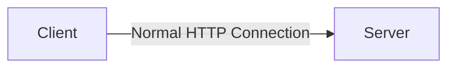
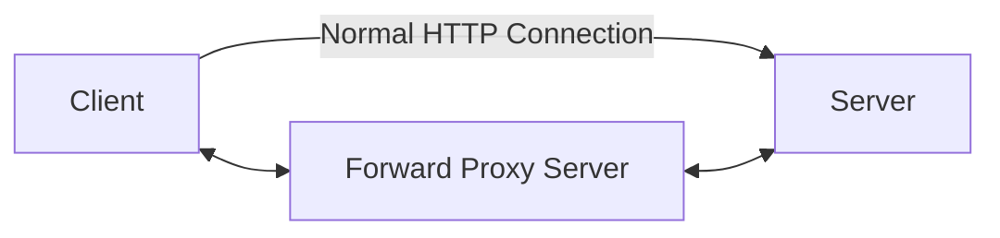
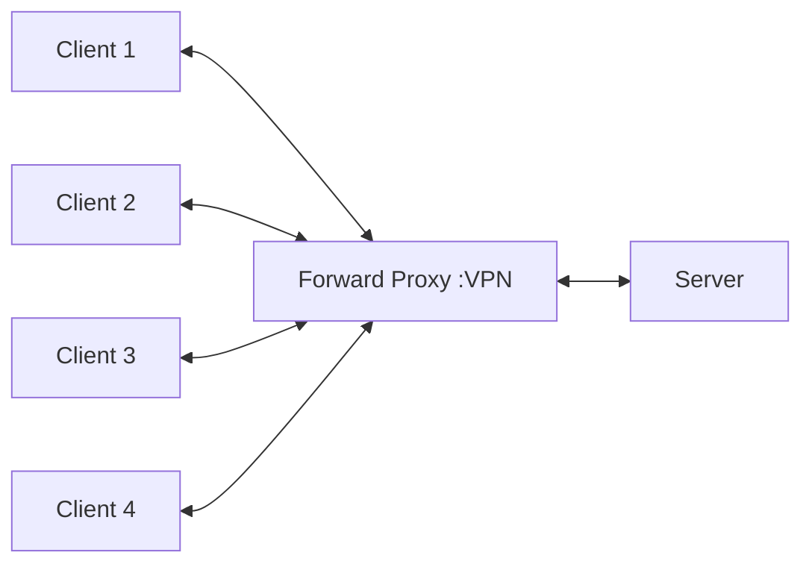
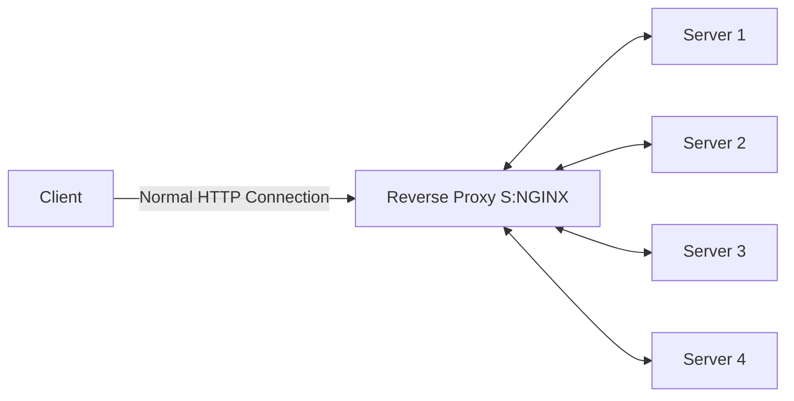
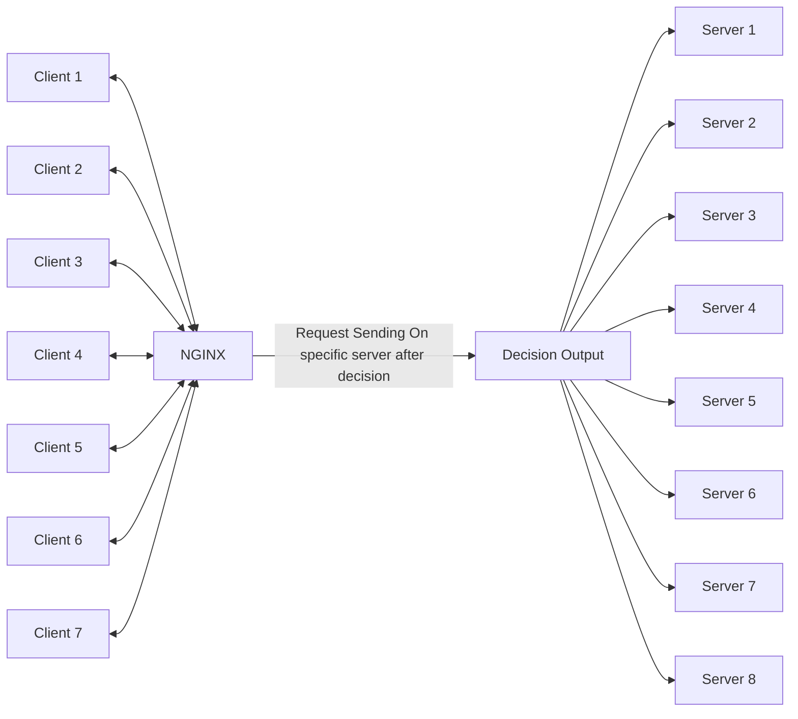
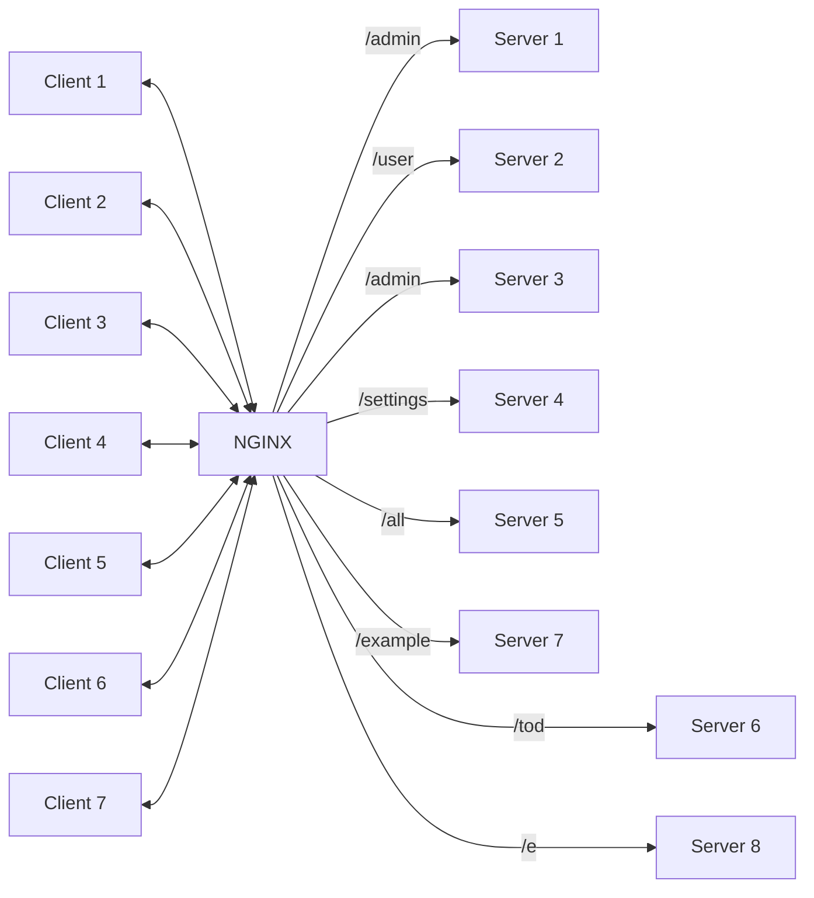

# Nginx-Docker

## NGINX

- Pronounciation :Engine X
- PowerFul Web Server
- Uses non-threaded and event driven structure
- Used as a reverse proxy server, load balancer, mail proxy server, and HTTP cache

**Installation using Docker**

```
docker pull nginx
```

**Run Command Using Dcoker**

```
docker run -p 8000:80 nginx
```

**Diagram of Normal HTTP Connection**



**Diagram of HTTP Connection with VPN**

- Forward Proxy Sever is used to connect to the VPN





- Server is not able to identify the client in forward proxy server
  - Forward Proxy Server is used to connect to the VPN

**Connection of NGINX**



- NGINX is used to connect to the VPN
  - Client is not able to identify the server in NGINX case



**More Clearation**



## Contributions

- Can Handle 10000 Concurrent Requests
- Catche HTTP Requests
- Act as Reverse Proxy
- Act as Load Balancer
- Act as an API Gateway(see upper example)
- Serve and Cache Static files like images ,videos etc.
- Handle SSL Certificates

## Codes

```
docker run -it -p 8080:80 ubuntu
```

```
apt-get update
```

```
apt-get install nginx
```

```
cd /etc/
```

```
ls
```

```
cd nginx/
```

```
ls
```

```
cat nginx.conf
```

```
apt-get install vim
```

```
touch nginx.conf
```

```
events {


}

http{
        server{
             listen 80;
             server_name _;
             location /{
                     return 200 "Return from Shubham NGINX MACHINE";
             }
       }


}

```

- i for write
- ctrc+c then
- :wq Enter

```
nginx -s reload
```
