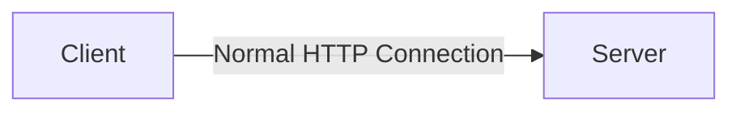
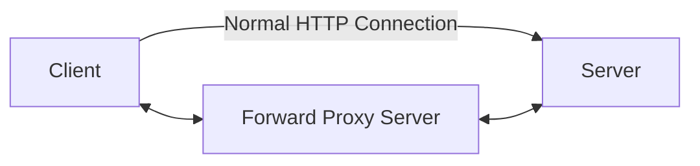
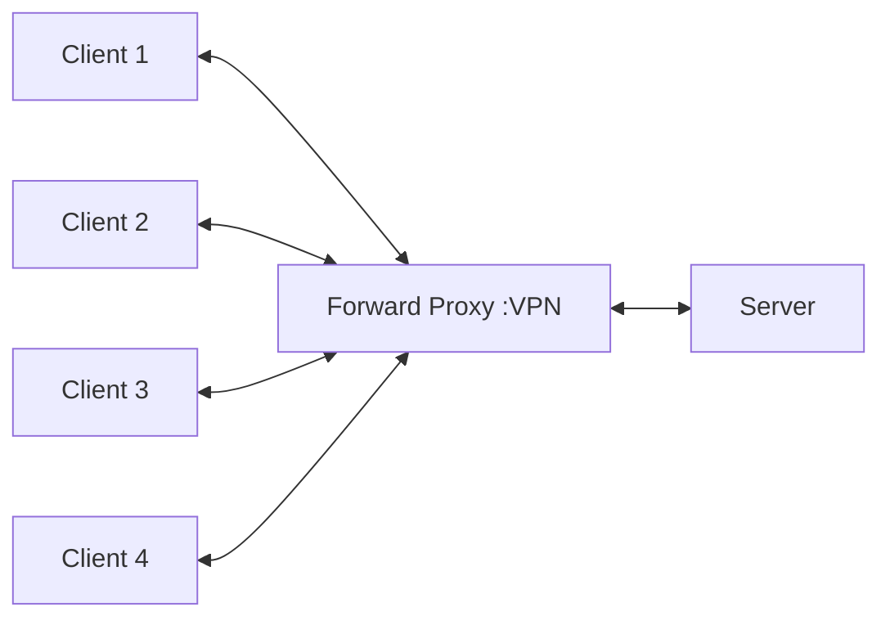
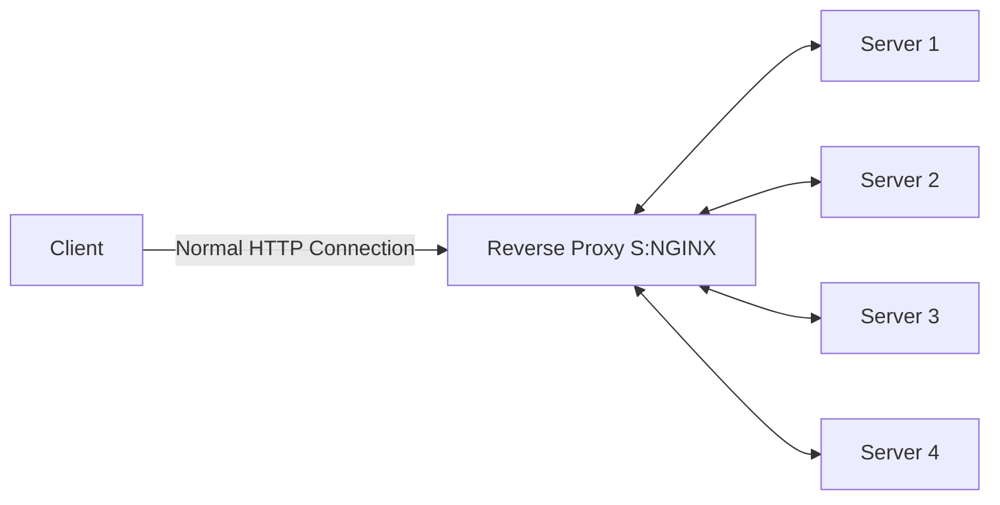
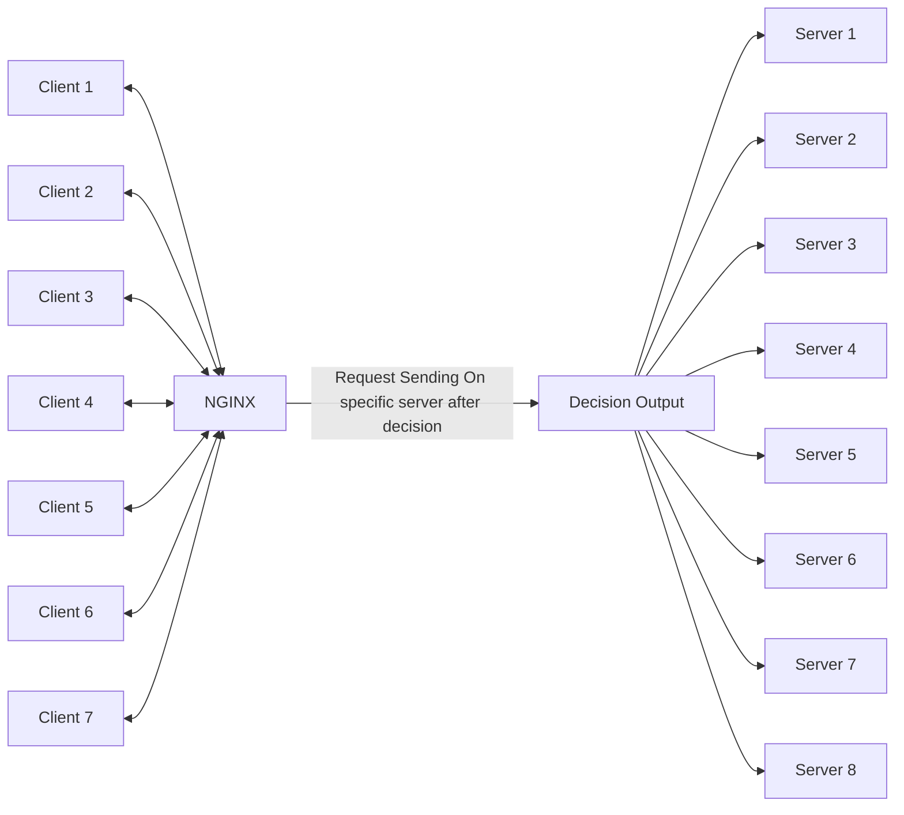
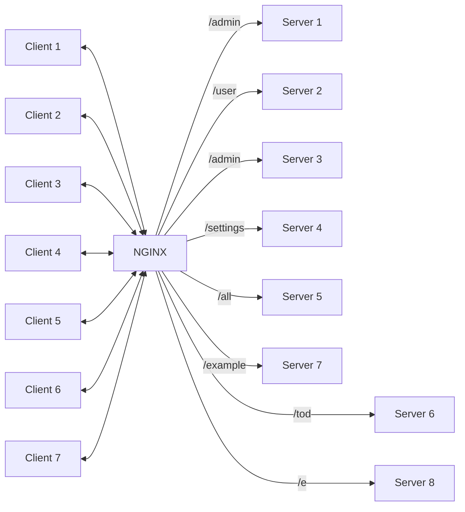

# Nginx-Docker

## NGINX

- Pronounciation :Engine X
- PowerFul Web Server
- Uses non-threaded and event driven structure
- Used as a reverse proxy server, load balancer, mail proxy server, and HTTP cache

**Installation using Docker**

```
docker pull nginx
```

**Run Command Using Dcoker**

```
docker run -p 8000:80 nginx
```

**Diagram of Normal HTTP Connection**



**Diagram of HTTP Connection with VPN**

- Forward Proxy Sever is used to connect to the VPN





- Server is not able to identify the client in forward proxy server
  - Forward Proxy Server is used to connect to the VPN

**Connection of NGINX**



- NGINX is used to connect to the VPN
  - Client is not able to identify the server in NGINX case



**More Clearation**



## Contributions

- Can Handle 10000 Concurrent Requests
- Catche HTTP Requests
- Act as Reverse Proxy
- Act as Load Balancer
- Act as an API Gateway(see upper example)
- Serve and Cache Static files like images ,videos etc.
- Handle SSL Certificates

## Codes

```
docker run -it -p 8080:80 ubuntu
```

```
apt-get update
```

```
apt-get install nginx
```

```
cd /etc/
```

```
ls
```

```
cd nginx/
```

```
ls
```

```
cat nginx.conf
```

```
apt-get install vim
```

```
touch nginx.conf
```

```
events {


}

http{
        server{
             listen 80;
             server_name _;
             location /{
                     return 200 "Return from Shubham NGINX MACHINE";
             }
       }


}

```

- i for write
- ctrc+c then
- :wq Enter

```
nginx -s reload
```

```
events {


}

http{
        types {
           text/css css;
           text/html html;
           text/js js;

        }
        server{
             listen 80;
             server_name _;
             location /{
                     return 200 "Return from Shubham NGINX MACHINE";
             }
       }


}


```


```
events {


}

http{
        types {
           text/css css;
           text/html html;
           text/js js;

        }
        server{
             listen 80;
             server_name _;

             root /etc/nginx/web;

       }


}


```

```
types {
    text/html                             html htm shtml;
    text/css                              css;
    text/xml                              xml;
    image/gif                             gif;
    image/jpeg                            jpeg jpg;
    application/javascript                js;
    application/atom+xml                  atom;
    application/rss+xml                   rss;

    text/mathml                           mml;
    text/plain                            txt;
    text/vnd.sun.j2me.app-descriptor      jad;
    text/vnd.wap.wml                      wml;
    text/x-component                      htc;

    image/png                             png;
    image/tiff                            tif tiff;
    image/vnd.wap.wbmp                    wbmp;
    image/x-icon                          ico;
    image/x-jng                           jng;
    image/x-ms-bmp                        bmp;
    image/svg+xml                         svg svgz;
    image/webp                            webp;

    application/font-woff                 woff;
    application/java-archive              jar war ear;
    application/json                      json;
    application/mac-binhex40              hqx;
    application/msword                    doc;
    application/pdf                       pdf;
    application/postscript                ps eps ai;
    application/rtf                       rtf;
    application/vnd.apple.mpegurl         m3u8;
    application/vnd.ms-excel              xls;
    application/vnd.ms-fontobject         eot;
    application/vnd.ms-powerpoint         ppt;
    application/vnd.wap.wmlc              wmlc;
    application/vnd.google-earth.kml+xml  kml;
    application/vnd.google-earth.kmz      kmz;
    application/x-7z-compressed           7z;
    application/x-cocoa                   cco;
    application/x-java-archive-diff       jardiff;
    application/x-java-jnlp-file          jnlp;
    application/x-makeself                run;
    application/x-perl                    pl pm;
    application/x-pilot                   prc pdb;
    application/x-rar-compressed          rar;
    application/x-redhat-package-manager  rpm;
    application/x-sea                     sea;
    application/x-shockwave-flash         swf;
    application/x-stuffit                 sit;
    application/x-tcl                     tcl tk;
    application/x-x509-ca-cert            der pem crt;
    application/x-xpinstall               xpi;
    application/xhtml+xml                 xhtml;
    application/xspf+xml                  xspf;
    application/zip                       zip;

    application/octet-stream              bin exe dll;
    application/octet-stream              deb;
    application/octet-stream              dmg;
    application/octet-stream              iso img;
    application/octet-stream              msi msp msm;

    application/vnd.openxmlformats-officedocument.wordprocessingml.document    docx;
    application/vnd.openxmlformats-officedocument.spreadsheetml.sheet          xlsx;
    application/vnd.openxmlformats-officedocument.presentationml.presentation  pptx;

    audio/midi                            mid midi kar;
    audio/mpeg                            mp3;
    audio/ogg                             ogg;
    audio/x-m4a                           m4a;
    audio/x-realaudio                     ra;

    video/3gpp                            3gpp 3gp;
    video/mp2t                            ts;
    video/mp4                             mp4;
    video/mpeg                            mpeg mpg;
    video/quicktime                       mov;
    video/webm                            webm;
    video/x-flv                           flv;
    video/x-m4v                           m4v;
    video/x-mng                           mng;
    video/x-ms-asf                        asx asf;
    video/x-ms-wmv                        wmv;
    video/x-msvideo                       avi;
}

```

```
events {


}

http{
        include /etc/nginx/mime.types;
        server{
             listen 80;
             server_name _;

             root  /etc/nginx/web;


       }


}


```
